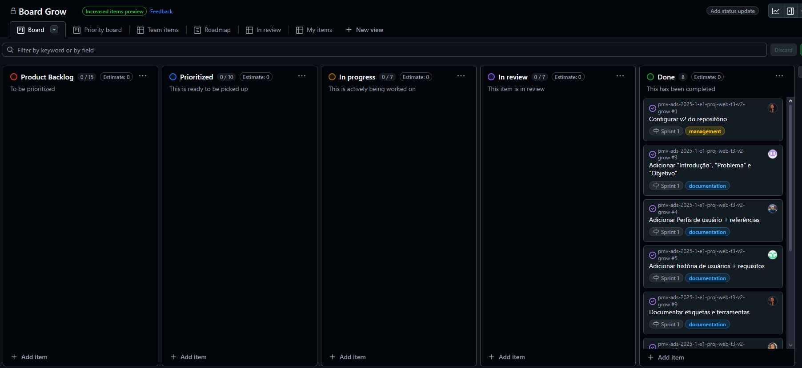
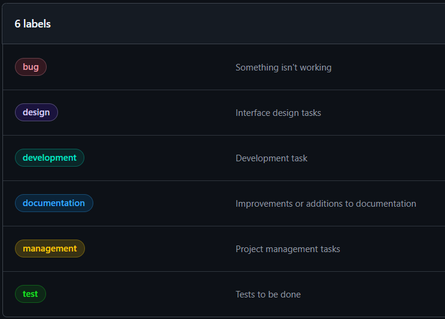

# Metodologia

## Gerenciamento de Projeto

Para garantir a organização e a eficiência no desenvolvimento do projeto, a equipe adotou uma metodologia ágil baseada no SCRUM, estruturando o trabalho em sprints curtas e definindo papéis específicos para cada membro. A equipe se reúne semanalmente para revisar o progresso, ajustar estratégias e garantir a entrega contínua de funcionalidades.

### Divisão de Papéis

A equipe está organizada da seguinte forma:
<ul>
 <li>Scrum Master: Amanda Maria Felipe Severo</li>
 <li>Product Owner: Rodrigo Andrade da Silva</li>
 <li>Equipe de Desenvolvimento: Amanda Maria Felipe Severo, Caroline Oliveira Neves, Edna dos Santos Martins, Fernanda Cunha Silva, Naiara Andrade Rodrigues de Oliveira, Rodrigo Andrade da Silva  </li>
</ul>
 
### Processo

Para organização e distribuição das tarefas do projeto, a equipe está utilizando o GitHub, estruturado com as seguintes listas: 

<ul>
  <li>Product Backlog: recebe as tarefas a serem trabalhadas e representa o Backlog do produto. Todas as atividades identificadas no decorrer do projeto são incorporadas a esta lista.</li>
  <li>Prioritized: lista de tarefas priorizadas da sprint atual.</li>
  <li>In progress: lista das tarefas em desenvolvimento.</li>
  <li>In Review: lista de tarefas feitas, mas que estão pendentes de revisão e/ou alinhamentos.</li>
  <li>Done: nesta lista são colocadas as tarefas finalizadas que passaram pelos testes e controle de qualidade, prontas para serem entregues aos usuários.</li>
 </ul>

 O quadro kanban do grupo no GitHub está disponível no link https://github.com/orgs/ICEI-PUC-Minas-PMV-ADS/projects/2029 e é apresentado, no estado atual, na figura abaixo:

 
    <figcaption>Figura 1 - Tela do quadro kanban no GitHub utilizado pelo grupo</figcaption>

### Etiquetas
<p>As tarefas são, ainda, etiquetadas em função da natureza da atividade e seguem o seguinte esquema de cores/categorias:</p>

<ul>
  <li>bug (Erro no código)</li>
  <li>design (Tarefas relacionadas à design)</li>
  <li>development (Documentação)</li>
  <li>documentation (Desenvolvimento)</li>
  <li>management (Gerenciamento do projeto)</li>
  <li>test (Testes)</li>
</ul>

 

<figure> 
  <figcaption>Figura 2 - Tela do esquema de cores e categorias das etiquetas</figcaption>
</figure> 
  
### Ferramentas

Atualmente, as ferramentas utilizadas no desenvolvimento do projeto são:

- Github - Ferramenta de administração do repositório e versões, usada para edição do conteúdo da documentação e versionamento.
- Microsoft Teams e Whatsapp - Ferramentas de comunicação, usadas para alinhamentos síncronos e assíncronos visando bom andamento das tarefas.
- Miro - Ferramenta para desenvolvimento de boards colaborativos, utilizada nos processos de ideação do projeto.
- Figma - Ferramenta de design, onde o grupo desenhou os wireframes de baixa fidelidade, além de configurar o protótipo (userflow).

Os artefatos do projeto são desenvolvidos a partir das plataformas GitHub, Figma e Miro. A tabela a seguir relaciona o propósito e plataforma de cada artefato, bem como seu link de acesso.

| AMBIENTE/PROPÓSITO                  | PLATAFORMA                         | LINK DE ACESSO                         |
|-------------------------------------|------------------------------------|----------------------------------------|
| Repositório de código fonte         | GitHub                             | https://github.com/ICEI-PUC-Minas-PMV-ADS/pmv-ads-2025-1-e1-proj-web-t3-v2-grow/blob/5c20725be80284a1758e16d4c5d3278662aa8aa0/codigo-fonte/README.md                            |
| Documentos do projeto               | GitHub                             | https://github.com/ICEI-PUC-Minas-PMV-ADS/pmv-ads-2025-1-e1-proj-web-t3-v2-grow                           |
| Projeto de Interface (wireframes)                | Figma                              | https://www.figma.com/design/RWJHBPy737PtE1Lvd0dw8O/Grow---Design?node-id=2798-5997&t=nc6BZH8L7tk8AfPb-1                           |
| Protótipo interativo (userflows)               | Figma                              | https://www.figma.com/proto/RWJHBPy737PtE1Lvd0dw8O/Grow---Design?node-id=2805-6040&p=f&t=XzLseDVJZP9pUi7c-1&scaling=scale-down&content-scaling=fixed&page-id=2798%3A5997&starting-point-node-id=2805%3A6040&show-proto-sidebar=1                           |
| Gerenciamento do Projeto            | GitHub Projects                    | https://github.com/orgs/ICEI-PUC-Minas-PMV-ADS/projects/2029                            |
| Rascunho de userflows por meio de fluxogramas            | Miro                    | https://miro.com/app/board/uXjVILzXmcw=/?share_link_id=484732218163                            |
| Board com dinâmica de descovery (É/NÃO É e FAZ/NÃO FAZ)           | Miro                   | https://miro.com/app/board/uXjVIaXyfxk=/?share_link_id=707322014092                            |


### Estratégia de Organização de Codificação 

Todos os artefatos relacionados a implementação e visualização dos conteúdos do projeto da aplicação foram inseridos na pasta [codigo-fonte](https://github.com/ICEI-PUC-Minas-PMV-ADS/pmv-ads-2025-1-e1-proj-web-t3-v2-grow/tree/main/codigo-fonte).

#### Convenção de commits
A equipe do projeto está usando uma convenção que padroniza os titulos nos commits, visando maior organização e fácil entendimento das modificações.
O padrão é: ```tipo de atuação: verbo + descrição```. Exemplos: 
```
docs: adiciona especificação do projeto
fix: remove quebra de linha excedente
```
E os tipos adotados são:
```
docs: para documentações
feat: para novas funcionalidades desenvolvidas
refactor: para melhorias sem modificação da funcionalidade
style: para aplicação de estilos CSS ou formatação do código sem alteração da função
fix: para quaisquer consertos
chore: para modificações na estrutura ou configuração base do projeto
```
